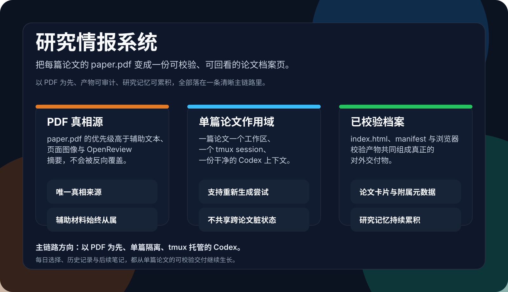
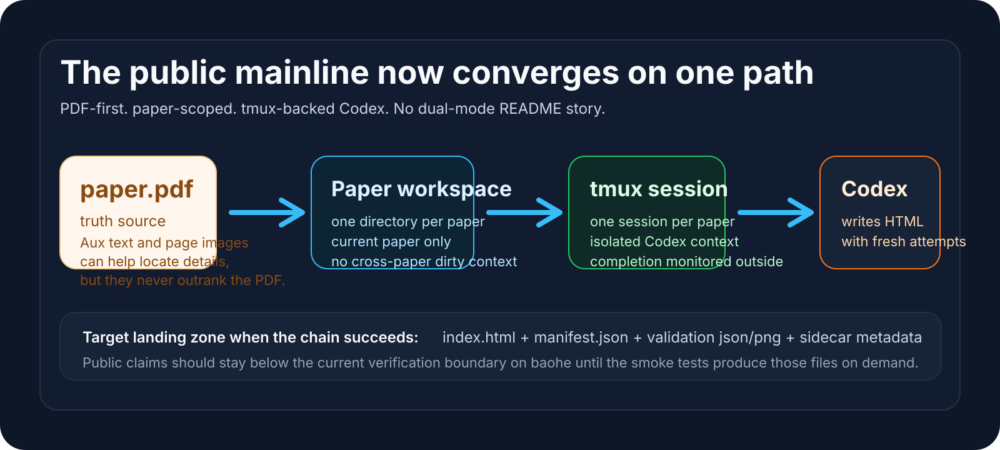
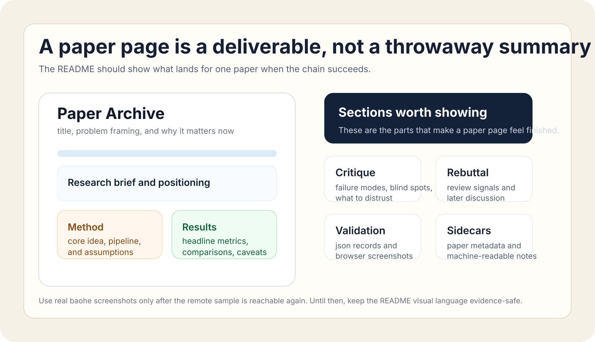

# Research Intel

`Research Intel` 是一个面向研究者的自托管论文情报系统。它不会把论文跟踪做成“抓一堆、推一堆”的信息流，而是围绕你的研究画像每天挑出一小组高相关论文，并把每篇入选论文沉淀成一个可审阅、可分享、可持续更新的 HTML archive。

If you want a paper workflow that stays grounded in the original PDF, leaves inspectable artifacts on disk, and keeps your long-term research state in files you control, this repository is built for that path.

<p align="center">
  
</p>

## Why It Feels Different

- 不是靠关键词一次抓几十篇论文然后群发
- 不是从抽取文本拼一段短摘要，第二天就作废
- 不是把长期研究状态锁进黑盒数据库
- 不是把所有论文都塞进同一个脏上下文里批量生成

## What You Actually Get

- 更小但更像主线的每日论文集合
- 每篇论文一个独立 HTML archive，而不是 throwaway summary
- file-backed research memory：`research_brief.md`、`seed_papers.jsonl`、`feedback.jsonl`、`method_tree_notes.md`
- 一条清晰默认工作流：`paper.pdf -> paper-scoped workspace -> tmux-backed Codex -> validated archive`

## Default Architecture

- `PDF-first`
  - `paper.pdf` 是唯一真相来源；抽取文本、页面图像和外部讨论只做辅助定位与核对。
- `Paper-scoped`
  - 每篇论文都有独立工作目录、独立上下文、独立产物，不共享跨论文脏状态。
- `Tmux-backed Codex`
  - 每篇论文都在独立 tmux session 中运行 Codex，便于追踪、恢复和核查。
- `Validated archive`
  - 生成结果不是一次性聊天回复，而是会落盘、再做浏览器校验的 standalone HTML 档案。

这条默认路径的目标不是“尽量多产出”，而是把每篇入选论文都做成一个后续还能复查、对照和继续扩写的研究资产。

<p align="center">
  
</p>

## How It Works

1. 从研究画像、种子论文和反馈中生成当天的候选池。
2. 选出一小组最贴近主线的问题论文，而不是最大化篇数。
3. 下载每篇论文的 `paper.pdf`。
4. 为每篇论文建立独立工作目录，并在独立 tmux session 中调用 Codex。
5. 生成 standalone HTML archive，并进行浏览器级校验。
6. 将日报、阅读顺序、方法账本和单篇 HTML 档案落到本地文件系统，供 Web 控制台、Telegram 和后续脚本继续使用。

## What A Paper Page Looks Like

Research Intel 的核心产物不是“摘要消息”，而是单篇论文页。每个页面都会把研究动机、问题定义、方法拆解、实验结论、评论与延伸问题组织成一个可读、可复查、可长期维护的档案。

<p align="center">
  
</p>

## Why You Can Trust The Output

- 所有单篇论文页都从 `paper.pdf` 起步，而不是从零散摘录拼装
- 每篇论文都在独立 tmux-backed Codex session 中生成
- 产物会落盘为 standalone HTML，而不是停留在对话窗口里
- 页面会经过浏览器级检查，排查远程依赖、占位符、控制台报错和缺失结构
- 运行结果、方法账本和历史记录都保存在本地文件系统里，便于审计、导出和二次开发

## 适合谁

- 需要每天获取 3 到 8 篇高相关论文，而不是几十篇关键词噪声
- 希望推荐逻辑能随着自己读过的论文和反馈持续变化
- 想把“看过什么、为什么今天看、它补了哪块方法拼图”沉淀为长期账本
- 希望整套系统能自托管、可审计、可改造

## 快速开始

### 0. 先确认 Codex CLI 可用

Research Intel 的默认路径是：让 tmux-backed Codex 围绕 `paper.pdf` 生成并验证单篇论文 HTML。这个仓库不负责你的 Codex 登录、provider、base URL 或 API key 配置；这些需要先在 Codex CLI 自己的配置层完成。下面这条命令只用于确认你的 CLI/provider 已经就绪。

最简单的宿主机自检方式：

```bash
codex exec --skip-git-repo-check -C /tmp -m gpt-5.4 "Reply with OK only."
```

如果这条命令在你的机器上还没通，先把 Codex CLI 配好，再继续下面的仓库初始化。

### 1. 三分钟试跑

如果你只是想先看看这套系统跑出来是什么样，不想先回答一轮初始化问题，可以先用示例画像试跑一遍：

```bash
npm install
cp .env.example .env
npm run profile:example
npm run daily:no-telegram
npm run web:start
```

如果你偏好 Docker：

```bash
cp .env.example .env
docker compose up -d web
docker compose run --rm profile-example
docker compose run --rm daily-no-telegram
```

这条路径默认**不会触发 Telegram 推送**，适合第一次试跑整条流程。

### 2. 安装依赖

```bash
npm install
cp .env.example .env
```

然后至少把 `.env` 里的这些项目级配置改成自己的值：

- Codex HTML 生成配置
  - `RESEARCH_INTEL_CODEX_HTML_MODEL`：默认 `gpt-5.4`
  - `RESEARCH_INTEL_CODEX_HTML_REASONING_EFFORT`：可选，默认 `medium`
  - `RESEARCH_INTEL_CODEX_HTML_TIMEOUT_MS`：可选，默认 `600000`
- Telegram 推送（可选）
  - `TELEGRAM_BOT_TOKEN`
  - `TELEGRAM_CHAT_ID`
  - 如果你本机访问 Telegram API 需要代理，再设置 `TELEGRAM_USE_PROXY=true` 与 `TELEGRAM_PROXY_URL`
- Web 控制台
  - `RESEARCH_INTEL_WEB_PASSWORD`
  - `RESEARCH_INTEL_WEB_SESSION_SECRET`
- 调度模式
  - `RESEARCH_INTEL_RUN_MODE=codex`

如果你先按默认路径使用，这些补充配置可以留空：

- `RESEARCH_INTEL_API_BASE_URL`
- `RESEARCH_INTEL_API_KEY`
- `RESEARCH_INTEL_HTML_MODELS`
- `RESEARCH_INTEL_CURATION_MODELS`
- `RESEARCH_INTEL_CHAT_TIMEOUT_MS`

`RESEARCH_INTEL_CODEX_HTML_MODEL` 默认值是 `gpt-5.4`：

- 保持默认：每篇论文会在独立 tmux session 中调用 Codex
- 每次生成都会从 `paper.pdf` 出发，并产出一个可校验的 standalone HTML 页面

### 3. 初始化研究画像

两种方式都支持：

- 交互式初始化
  ```bash
  npm run profile:init
  ```
- 复制示例画像
  ```bash
  npm run profile:example
  ```

交互式脚本会逐步问你：

- 研究方向是什么
- 当前阶段想解决什么问题
- 哪些关键词该高权重
- 哪些信号该降权
- 每天想看几篇
- 长期账本第一层要按哪些问题展开
- 哪些论文是你的锚点

生成结果会写入 `work/research-intel/profile/`。

如果你更喜欢 Web 首次填写，而不是在终端里逐题回答：

1. 先启动 Web 控制台
   ```bash
   npm run web:start
   ```
2. 打开 `http://127.0.0.1:3086/research-intel/`
3. 登录后进入 `编辑区`
4. 先填写 `首次使用 / 研究画像向导`
5. 如果你手上已经有感兴趣论文，再用 `论文导入 / 批量种子录入` 补进去
6. 勾选“保存后立即触发一次今日运行”，或稍后手动执行 `npm run daily:no-telegram`

仓库里的 `examples/profile/default/` 只是一个演示样例，用来展示画像文件长什么样，不会自动覆盖你的真实运行画像。
如果你手动执行 `npm run profile:example`，它会把示例画像写入 `work/research-intel/profile/`，因此更适合第一次试跑或空白环境。

### 4. 先跑一轮生成流程

```bash
npm run daily:no-telegram
```

如果链路通了，再按需要打开 Telegram 这种下游分发能力。

如果你已经把 Telegram 配置填好，可以直接跑：

```bash
npm run daily
```

第一次建议先用 `daily:no-telegram` 跑通默认流程，再切到真实推送。

### 5. 启动 Web 控制台

```bash
npm run web:start
```

默认访问地址：

```text
http://127.0.0.1:3086/research-intel/
```

### 6. 启动每日调度

两种方式都支持：

- 宿主机 cron
  ```bash
  npm run cron:install
  ```
- Docker / 容器调度循环
  ```bash
  docker compose up -d scheduler
  ```

## 默认运行模式

默认运行模式是 `codex`：

- 通过 `codex-supervisor.js` 启动 tmux worker、心跳监控和恢复逻辑
- 这是仓库默认维护和验证的运行方式
- 如果你没有特别的定制需求，保持默认即可

通过 `.env` 里的 `RESEARCH_INTEL_RUN_MODE` 保持默认值：

```env
RESEARCH_INTEL_RUN_MODE=codex
```

## Docker Compose

```bash
docker compose up -d web
docker compose run --rm profile-example
docker compose run --rm daily-no-telegram
docker compose up -d scheduler
```

Compose 镜像会安装 `codex` CLI，并默认把宿主机 `${HOME}/.codex` 挂载到容器内的 `/root/.codex`，这样容器里的 Web 手动触发、`daily-no-telegram` 和调度循环都能复用你宿主机已经配置好的 Codex 认证状态。

如果你的 Docker 运行环境拿不到宿主机 `${HOME}/.codex`，优先使用宿主机模式，不要假设容器会自动完成 Codex 登录。

容器里默认会挂载：

- `./work -> /app/work`
- `./research-intel-records -> /app/research-intel-records`
- `./logs -> /app/logs`

这样重建镜像不会丢失画像、账本和日报历史。

如果你要用自己的画像而不是示例画像，可以把 `profile-example` 换成交互式的 `init-profile`。

## 前置条件

### 宿主机模式

- Node.js 20+
- `pdftotext`
  - Debian / Ubuntu: `sudo apt-get install poppler-utils`
- Chrome / Chromium
  - 用于 HTML 浏览器校验
- `tmux` 与 `codex`
  - 默认部署路径需要这两项
  - 开始前先确保当前 shell 里 `codex exec -m gpt-5.4 ...` 已经能独立跑通

### Docker 模式

- Docker Engine
- Docker Compose

## 仓库结构

```text
research-intel/
├── examples/profile/default/        # 示例画像（演示用，可替换为任意研究领域）
├── scripts/bootstrap/               # 冷启动初始化脚本
├── scripts/research-intel/          # 核心调度、HTML、Web、推送逻辑
├── tests/                           # 单元测试
├── work/                            # 运行态（git ignore）
└── research-intel-records/          # 产物与历史（git ignore）
```

仓库里只应提交代码、示例画像和文档。你的真实 `work/`、`research-intel-records/`、`.env` 不应该进入版本库。

## 宿主机 Cron

```bash
npm run cron:install
```

这个脚本会：

- 从 `work/research-intel/profile/research_brief.md` 读取 `timezone` 和 `send_time`
- 用 `RESEARCH_INTEL_VERIFY_DELAY_MINUTES` 计算验证任务时间
- 安装每日主运行和验证补发两条 cron

改完画像时间后，重新执行一次 `npm run cron:install` 即可覆盖旧配置。

## 跑完之后会看到什么

第一次安全试跑完成后，你通常会得到这几类结果：

- `work/research-intel/profile/`
  - 你的画像文件、锚点论文和长期偏好入口
  - Web 导入的单篇/批量论文也会沉淀到这里的 `seed_papers.jsonl`
- `research-intel-records/daily/<date>/`
  - 当天的 brief、reading order、method tree 和单篇 HTML 档案
- `http://127.0.0.1:3086/research-intel/`
  - 登录后的 Web 控制台，可查看历史日报、知识账本和运行状态
  - `编辑区` 可继续修改研究画像、导入论文、再触发一轮运行

如果当天链路已经跑完，但发现有漏发或想做补发验证，可以执行：

```bash
npm run verify
```

## 数据与隐私边界

这些东西默认不应该进 Git：

- `.env`
- `work/`
- `research-intel-records/`
- 日报 HTML、PDF、失败截图、运行日志、历史发送记录

如果你要公开自己的实例，建议只公开：

- 代码
- 脱敏后的 `examples/profile/`
- 少量演示截图

不要直接公开真实运行产物和真实研究历史。

## 文档

- [架构说明](docs/架构说明.md)
- [部署说明](docs/部署说明.md)
- [初始化画像说明](docs/初始化画像说明.md)
- [数据目录说明](docs/数据目录说明.md)

## 测试

```bash
npm test
```

## 许可证

MIT
