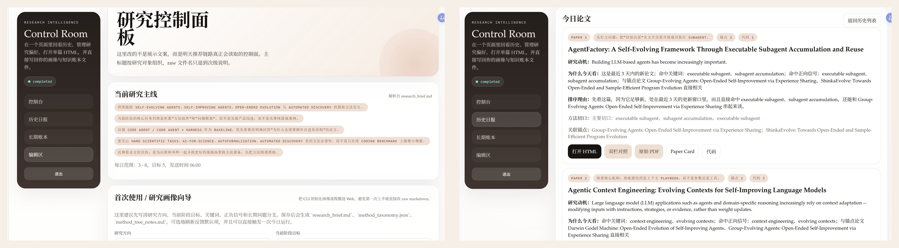

# Research Intel（研究情报系统）

> 不是给想刷更多论文的人。  
> 是给想把研究主线慢慢做厚的人。

`Research Intel` 会从你的研究画像、种子论文和反馈里，只留下当天真正贴着主线的那几篇论文。每篇都从 `paper.pdf` 出发，最后整理成可继续回看、补写、交叉引用的 HTML 档案。推荐逻辑、阅读历史和方法线索都留在你自己的文件系统里。

适合已经有研究主线，但不想再被关键词结果和一次性摘要牵着走的人。

[快速开始](#快速开始) · [部署说明](docs/部署说明.md) · [v0.1.0 Release](https://github.com/cnfjlhj/research-intel/releases/tag/v0.1.0)

下面直接看实际界面：



左边是控制台，右边是当天论文页。截图来自当前仓库的真实运行界面，不是概念图。

## 它和普通论文推送工具不太一样

- `以 PDF 为先`：每篇论文都从 `paper.pdf` 出发，不是拼二手摘要。
- `一篇论文一个工作区`：每篇论文独立目录、独立上下文、独立产物，不和别的论文混在一起。
- `产物会落盘`：最后得到可独立打开的 HTML 档案页，不是一次性聊天摘要。
- `研究状态在你自己手里`：画像、反馈、方法账本、历史日报都在本地文件里，可审计、可导出、可继续改。

## 它解决什么问题

- 每天看几十篇关键词结果，噪声太大，真正值得读的论文反而埋掉了
- 一次性摘要很快过期，第二天很难回头对照和继续扩写
- 长期研究状态容易锁进黑盒数据库，难审计、难导出、难改造
- 多篇论文共用一个脏上下文，最后很难知道每个结论到底从哪来

## 你会得到什么

- 更小但更像主线的每日论文集合
- 每篇论文一个独立 HTML 档案页，而不是一次性聊天摘要
- 可长期累积的文件化研究记忆：`research_brief.md`、`seed_papers.jsonl`、`feedback.jsonl`、`method_tree_notes.md`
- 一条清晰默认主链路：`paper.pdf -> 单篇论文工作区 -> tmux 独立会话中的 Codex -> 已校验档案页`

## 默认主链路

- `以 PDF 为先`：`paper.pdf` 是唯一真相来源；抽取文本、页面图像和外部讨论都只能做辅助定位与核对。
- `单篇论文作用域`：每篇论文都有独立工作目录、独立上下文、独立产物，不共享跨论文脏状态。
- `tmux 托管的 Codex`：每篇论文都在独立 tmux 会话中运行，便于追踪、恢复和核查。
- `已校验档案页`：生成结果会落盘，并经过浏览器校验，而不是停留在一次性聊天窗口里。

这条主链路的目标不是“尽量多产出”，而是把每篇入选论文都做成后续还能复查、对照和继续扩写的研究资产。


## 它怎么工作

1. 从研究画像、种子论文和反馈中生成当天候选池。
2. 选出一小组最贴近当前主线的问题论文，而不是最大化篇数。
3. 下载每篇论文的 `paper.pdf`。
4. 为每篇论文建立独立工作目录，并在独立 tmux session 中调用 Codex。
5. 生成可独立打开的 HTML 档案页，并做浏览器级校验。
6. 将日报、阅读顺序、方法账本和单篇 HTML 档案落到本地文件系统，供 Web 控制台、Telegram 和后续脚本继续使用。

## 单篇论文页里有什么

Research Intel 的核心产物不是“消息摘要”，而是单篇论文页。每个页面都会把研究动机、问题定义、方法拆解、实验结论、评论与延伸问题组织成一个可读、可复查、可长期维护的档案。


## 为什么可以信它

- 所有单篇论文页都从 `paper.pdf` 起步，而不是从零散摘录拼装
- 每篇论文都在独立 tmux 会话里的 Codex 中生成
- 产物会落盘为可独立打开的 HTML 档案页，而不是停留在对话窗口里
- 页面会经过浏览器级检查，排查远程依赖、占位符、控制台报错和缺失结构
- 运行结果、方法账本和历史记录都保存在本地文件系统里，便于审计、导出和二次开发

## 适合谁

- 需要每天获取 3 到 8 篇高相关论文，而不是几十篇关键词噪声
- 希望推荐逻辑能随着自己读过的论文和反馈持续变化
- 想把“为什么今天看这篇、它补了哪块方法拼图”沉淀为长期账本
- 希望整套系统能自托管、可审计、可改造

## 快速开始

如果你是第一次接触这个仓库，推荐按下面这条路径来：

```text
先确认 codex CLI 自己可用
-> 复制 .env.example
-> 只改最小必填配置
-> 用示例画像跑一轮 daily:no-telegram
-> 再启动 Web 看结果
-> 最后再补 Telegram 和 cron
```

### 0. 先确认 Codex CLI 可用

Research Intel 的默认路径是：让运行在 tmux 独立会话中的 Codex 围绕 `paper.pdf` 生成并验证单篇论文 HTML。这个仓库不负责你的 Codex 登录、服务提供方、基础地址或 API key 配置；这些需要先在 Codex CLI 自己的配置层完成。下面这条命令只用于确认你的 CLI 与服务配置已经就绪。

```bash
codex exec --skip-git-repo-check -C /tmp -m gpt-5.4 "Reply with OK only."
```

如果这条命令在你的机器上还没通，先把 Codex CLI 配好，再继续下面的仓库初始化。

### 1. 安装依赖并复制配置

```bash
npm install
cp .env.example .env
```

### 2. 第一次本地试跑，先只改最小配置

如果你只是想先把链路跑通，不要一开始就把所有变量都填满。第一次本地 smoke run，通常只需要先确认：

- `codex exec ...` 已经在当前机器上独立可用
- `.env` 里至少改掉 Web 登录的两项：`RESEARCH_INTEL_WEB_PASSWORD`、`RESEARCH_INTEL_WEB_SESSION_SECRET`
- Telegram 相关变量先留空，因为第一轮建议跑 `npm run daily:no-telegram`
- `RESEARCH_INTEL_CODEX_HTML_MODEL`、`RESEARCH_INTEL_CODEX_HTML_REASONING_EFFORT`、`RESEARCH_INTEL_CODEX_HTML_TIMEOUT_MS` 一般先保持 `.env.example` 默认值即可
- `RESEARCH_INTEL_CHROME_PATH` 只有在浏览器校验阶段报“找不到浏览器”时才需要手动设置

最小可运行配置可以直接从这个块开始：

```dotenv
RESEARCH_INTEL_WEB_PASSWORD=replace-with-a-strong-password
RESEARCH_INTEL_WEB_SESSION_SECRET=replace-with-a-long-random-secret
```

如果你此时还不准备启 Web，只想先看 `daily:no-telegram` 是否跑通，那么项目级配置甚至可以先只保留 `.env.example` 默认值，等你要打开 Web 时再补上上面两项。

### 3. 初始化研究画像

第一次推荐优先用示例画像试跑，先确认整条链路是通的，再换成你自己的研究方向。

两种方式都支持：

- 复制示例画像
  ```bash
  npm run profile:example
  ```
- 交互式初始化
  ```bash
  npm run profile:init
  ```

如果你更喜欢先看真实效果，推荐先执行：

```bash
npm run profile:example
```

这会把示例画像写入 `work/research-intel/profile/`，更适合第一次试跑或空白环境。

交互式脚本会逐步询问：

- 研究方向是什么
- 当前阶段想解决什么问题
- 哪些关键词该高权重
- 哪些信号该降权
- 每天想看几篇
- 长期账本第一层要按哪些问题展开
- 哪些论文是你的锚点

无论哪种方式，生成结果都会写入 `work/research-intel/profile/`。

如果你更喜欢在 Web 里完成第一次填写，而不是在终端里逐题回答：

1. 先启动 Web 控制台
   ```bash
   npm run web:start
   ```
2. 打开 `http://127.0.0.1:3086/research-intel/`
3. 登录后进入 `编辑区`
4. 先填写 `首次使用 / 研究画像向导`
5. 如果你手上已经有感兴趣论文，再用 `论文导入 / 批量种子录入` 补进去
6. 勾选“保存后立即触发一次今日运行”，或稍后手动执行 `npm run daily:no-telegram`

仓库里的 `examples/profile/default/` 只是一个演示样例，用来展示画像文件长什么样，不会自动覆盖你的真实运行画像。只有你手动执行 `npm run profile:example` 时，它才会写入 `work/research-intel/profile/`。

### 4. 先跑一轮无推送生成流程

```bash
npm run daily:no-telegram
```

第一次强烈建议先用 `daily:no-telegram` 跑通默认流程，再切到真实推送。这样你可以先验证：

- 论文是否能正常下载
- 每篇论文的独立 HTML 是否能生成
- 浏览器级校验是否能通过
- route / dependency / ledger 等工件是否都已落盘

如果这一步失败，优先看终端报错、`work/research-intel/daily/<date>/` 和 `research-intel-records/daily/<date>/` 里的输出，再决定是否需要补 `RESEARCH_INTEL_CHROME_PATH`、Telegram 代理或其他环境项。

### 5. 启动 Web 控制台并查看结果

如果 `daily:no-telegram` 已经跑通，再启 Web 看产物最稳：

```bash
npm run web:start
```

默认访问地址：

```text
http://127.0.0.1:3086/research-intel/
```

登录后你应该能看到：

- 最近一次运行状态
- 历史日报列表
- 当天的论文卡片和单篇 HTML 入口
- `编辑区` 里的研究画像、种子论文和反馈入口

### 6. 确认本地链路稳定后，再接 Telegram

如果你已经完成上面的本地验证，再回到 `.env` 补这些推送配置：

- `TELEGRAM_BOT_TOKEN`
- `TELEGRAM_CHAT_ID`
- 如果当前网络访问 Telegram API 需要代理，再补：
  - `TELEGRAM_USE_PROXY=true`
  - `TELEGRAM_PROXY_URL=...`

然后再执行：

```bash
npm run daily
```

### 7. 最后再安装每日调度

```bash
npm run cron:install
```

默认调度主链路就是宿主机 cron -> `run-daily.sh` -> `codex-supervisor.js` -> 按论文拆分的 tmux 托管 Codex HTML 生成。

`npm run cron:install` 会从 `work/research-intel/profile/research_brief.md` 读取 `timezone` 和 `send_time`，并额外安装一次验证补发任务。

## 前置条件

### 宿主机模式

- Node.js 20+
- `pdftotext`
  - Debian / Ubuntu: `sudo apt-get install poppler-utils`
- Chrome / Chromium
  - 用于 HTML 浏览器校验
- `tmux` 与 `codex`
  - 默认部署路径需要这两项
  - 开始前先确保当前 shell 里 `codex exec -m gpt-5.4 ...` 已经能独立跑通

## 仓库结构

```text
research-intel/
├── examples/profile/default/        # 示例画像（演示用，可替换为任意研究领域）
├── scripts/bootstrap/               # 冷启动初始化脚本
├── scripts/research-intel/          # 核心调度、HTML、Web、推送逻辑
├── tests/                           # 单元测试
├── work/                            # 运行态（git ignore）
└── research-intel-records/          # 产物与历史（git ignore）
```

仓库里只应提交代码、示例画像和文档。你的真实 `work/`、`research-intel-records/`、`.env` 不应该进入版本库。

## 本地、GitHub、宿主机的关系

- 本地 Git 仓库
  - 代码真相源，应该优先在这里开发、测试和提交。
- GitHub 仓库
  - 用来同步脚本、测试和文档，不承载你的运行态数据。
- 宿主机部署目录
  - 用来跑 Web、cron、tmux worker 和当天产物。
  - 它可以不是 Git 仓库，更接近“运行副本”而不是“开发主仓库”。

推荐顺序：

1. 在本地仓库完成改动并跑测试。
2. 推到 GitHub，保持代码源清晰。
3. 再把代码同步到宿主机，但保留宿主机自己的 `.env`、`work/`、`research-intel-records/`。

## 宿主机升级

对已有宿主机做代码升级时，建议只同步代码，不覆盖运行态：

```bash
rsync -az --exclude '.git/' \
  --exclude 'node_modules/' \
  --exclude 'work/' \
  --exclude 'research-intel-records/' \
  --exclude '.env' \
  /path/to/local/research-intel/ host:/path/to/deploy/research-intel/
```

同步后至少做两步核验：

```bash
bash -lc "cd /path/to/deploy/research-intel && node --test tests/codex-enhancement-config.test.js tests/test-research-intel-codex-html.js"
bash -lc "cd /path/to/deploy/research-intel && bash scripts/research-intel/status-web.sh"
```

如果宿主机上的 `codex`、`npm` 或 `node` 依赖 `nvm`/登录 shell 初始化，优先用 `bash -lc` 执行远端命令，避免 PATH 假阴性。

## 宿主机 Cron

```bash
npm run cron:install
```

这个脚本会：

- 从 `work/research-intel/profile/research_brief.md` 读取 `timezone` 和 `send_time`
- 用 `RESEARCH_INTEL_VERIFY_DELAY_MINUTES` 计算验证任务时间
- 安装每日主运行和验证补发两条 cron

改完画像时间后，重新执行一次 `npm run cron:install` 即可覆盖旧配置。

## 跑完之后会看到什么

第一次安全试跑完成后，你通常会得到这几类结果：

- `work/research-intel/profile/`
  - 画像文件、锚点论文和长期偏好入口
  - Web 导入的单篇或批量论文也会沉淀到 `seed_papers.jsonl`
- `research-intel-records/daily/<date>/`
  - 当天的 brief、reading order、method tree 和单篇 HTML 档案
- `http://127.0.0.1:3086/research-intel/`
  - 登录后的 Web 控制台，可查看历史日报、知识账本和运行状态
  - `编辑区` 可继续修改研究画像、导入论文、再触发一轮运行

如果当天链路已经跑完，但发现有漏发或想做补发验证，可以执行：

```bash
npm run verify
```

## 数据与隐私边界

这些东西默认不应该进 Git：

- `.env`
- `work/`
- `research-intel-records/`
- 日报 HTML、PDF、失败截图、运行日志、历史发送记录

如果你要公开自己的实例，建议只公开：

- 代码
- 脱敏后的 `examples/profile/`
- 少量演示截图

不要直接公开真实运行产物和真实研究历史。

## 文档

- [架构说明](docs/架构说明.md)
- [部署说明](docs/部署说明.md)
- [初始化画像说明](docs/初始化画像说明.md)
- [数据目录说明](docs/数据目录说明.md)

## 测试

```bash
npm test
```

## 许可证

MIT
